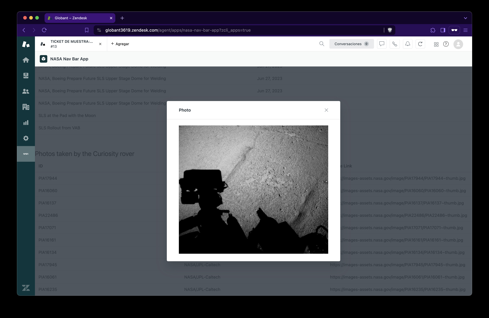

NASA Nav Bar App
===

## Overview

This is an app that can be used in the Zendesk Support Nav Bar. I used React for this test and here's an explanation about the project and things I faced.

Here's the app showing two tables. The first one lists 20 photos of NASA Space Launch System and the second one lists 10 photos taken by curiosity rover.

In the first table, if you click on the title, a modal shows up with the photo.

In the second table, if you click on the image link, a modal shows up with the photo.

## Installation

In order to install and test the project locally:

1. Clone the project.
2. Run `npm install` to install dependencies.
3. Run `npm run dev`.
4. By default the project can be tested locally in `http://localhost:5173/`

It also can be tested in the demo url: https://65e3ccefffad9222c8180213--kaleidoscopic-froyo-653973.netlify.app/

## Considerations

- While developing the app I couldn't exactly retrieve the query for the second table (photos taken by the Curiosity rover from its Mast camera on SOL 1050). I tried using the `q` parameter as well as `keywords`, `description`, `title`, etc. I couldn't find any results regarding the search requirements. Maybe I can try more combinations but for the porpuses of this test I replaced the column `Rover ID` for `Secondary Creator`.
- Also I noticed that the test required to call the API whenever the element of the row is clicked. I consider that in the first API call I can save the urls of the images and send them as props to the Modal component without performing another API call but I did it for this test.
- Zendesk documentation mention the use of the Zendesk App Framework Client so I created a custom hook in case I need it. In the end I didn't for this test.
- I used the components of Garden Zendesk and the presentation can be improved with a little more time and love.
- I developed the app using React + Vite because I develop faster that way.
- I also noticed that Zendesk provides a command to create a react app but I already started working with Vite.
- In the manifest.js is the url of the app hosted in my netlfy account.
- I created a custom hook called `useFetch` to perform the API calls and reuse it everywhere I need it.
- The size and presentation of the images can be optimized and be more consistent with custom CSS. Garden Zendesk doesn't have an image component.

## Thank you for the opportunity and your time

> Asael Chavez
